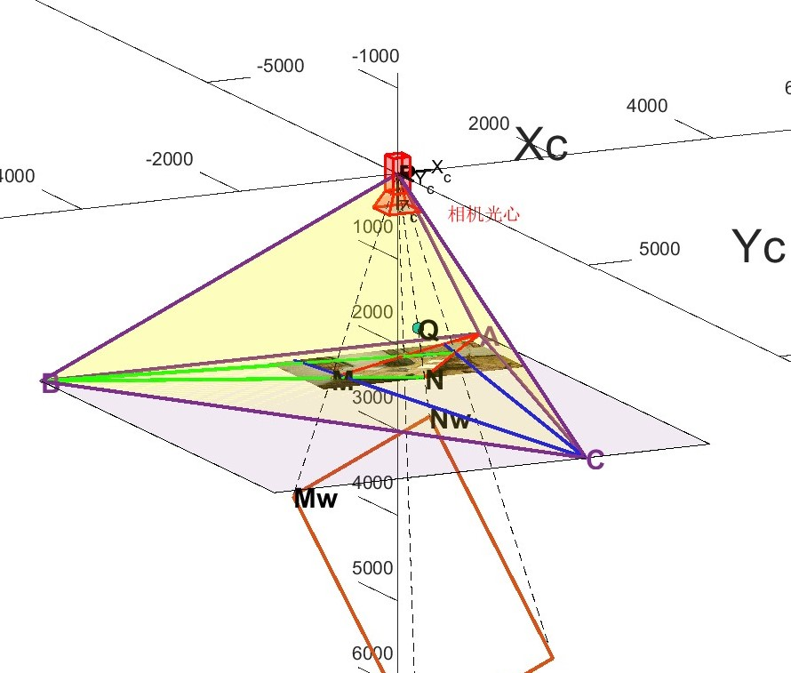
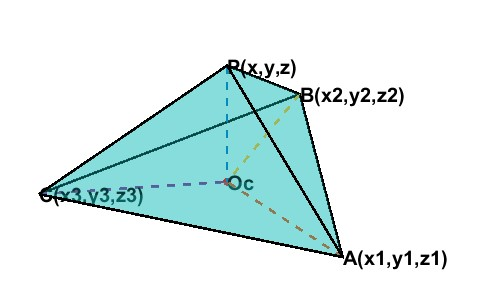

# single image calibration

## Overview

Implementation and visualisation of multiple classical linear calibration methods for a single image.This repo aims to provide as many single image calibration methods as possible for linear [pinhole cameras](https://en.wikipedia.org/wiki/Pinhole_camera_model#The_geometry_and_mathematics_of_the_pinhole_camera), solving for camera intrinsic and extrinsic parameters based on known 3D-2D or other auxiliary conditions, and presenting them in the most intuitive way,deepening the understanding of the camera imaging process.

仅使用单张图像完成多种经典标定方法实现与可视化。本仓库旨在提供尽可能多的单张图像标定方法，线性[针孔相机](https://en.wikipedia.org/wiki/Pinhole_camera_model#The_geometry_and_mathematics_of_the_pinhole_camera)，根据已知的3D-2D或其他辅助条件求解相机内参和外参，并以最直观的方式呈现，加深对相机成像过程的理解。

## Requirements

- MATLAB® R2022b or later(Because Computer Vision Toolbox™ has [switched to the "Premultiply Convention"](https://ww2.mathworks.cn/help/images/migrate-geometric-transformations-to-premultiply-convention.html) since R2022b.)
- Image Processing Toolbox™
- Computer Vision Toolbox™

Note: If you are using MATLAB version R2022a or earlier, use [v1.0 of this repository](https://github.com/cuixing158/singleImageCalibration/tree/1.0)!

## Algorithms

Current have these algorithms:

- Method1：Decompose camera projection matrix(QR decomposition)
- Method2：Decompose camera projection matrix(intrinsic and extrinsic properties)
- Method3：tsai calibration
- Method4：Geometric solution
- Method5：Algebraic solution

## Some visualizations

    
     
    
Draw Mapping

    
     
    
Vanishing Lines Overview

    
     
    
Stereo Visualization

    
     
    
Trirectangular Tetrahedron

## Implementation and Get Started

Implemented in "lean and elegant" code that is easy to read. See `demoOneImgCalibrate.mlx` or [demoOneImgCalibrate.md](./demoOneImgCalibrate.md) format entry file.

To getting started,there are two ways：

- click  to open `demoOneImgCalibrate.mlx` in MATLAB Online®(in your web browser with no installation required).
- Download or clone this repository to your local machine and open `demoOneImgCalibrate.mlx` in MATLAB®

  Then just run ,take enjoy yourself!
