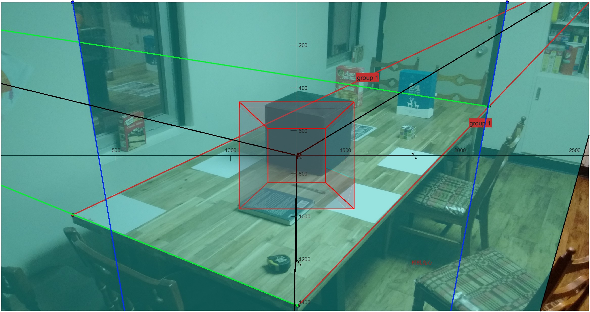

#single image calibration

## Overview
> Implementation and visualisation of multiple classical linear calibration methods for a single image.This repo aims to provide as many single image calibration methods as possible for linear [pinhole cameras](https://en.wikipedia.org/wiki/Pinhole_camera_model#The_geometry_and_mathematics_of_the_pinhole_camera), solving for camera intrinsic and extrinsic parameters based on known 3D-2D or other auxiliary conditions, and presenting them in the most intuitive way,deepening the understanding of the camera imaging process.

>仅使用单张图像完成多种经典标定方法实现与可视化。本仓库旨在提供尽可能多的单张图像标定方法，线性[针孔相机](https://en.wikipedia.org/wiki/Pinhole_camera_model#The_geometry_and_mathematics_of_the_pinhole_camera)，根据已知的3D-2D或其他辅助条件求解相机内参和外参，并以最直观的方式呈现，加深对相机成像过程的理解。

## Algorithms
current have these algorithms:
- Method1：Decompose camera projection matrix(QR decomposition)
- Method2：Decompose camera projection matrix(intrinsic and extrinsic properties)
- Method3：tsai calibration
- Method4：Geometric solution
- Method5：Algebraic solution

## Some visualizations

## Implementation 
Implemented in "lean and elegant" code that is easy to read,just run `demoOneImgCalibrate.mlx` or see [demoOneImgCalibrate.md](./demoOneImgCalibrate.md) format! take enjoy yourself!

