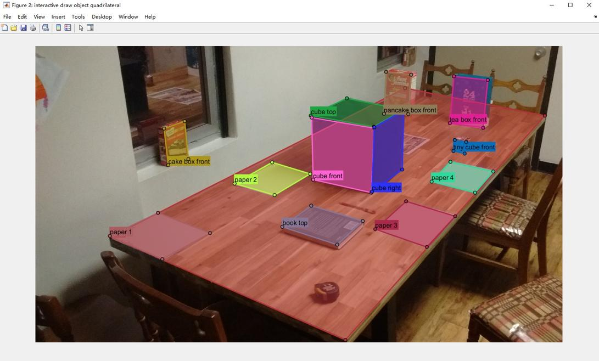
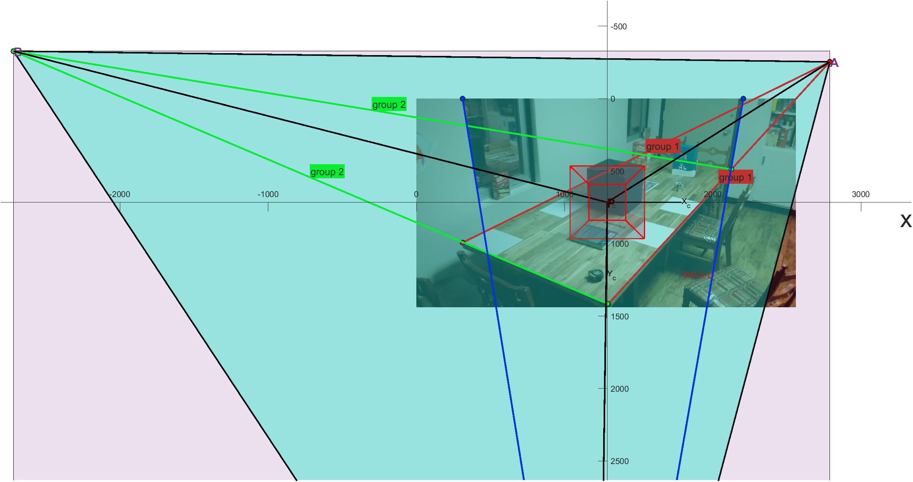

# single image calibration

## Overview

Implementation and visualisation of multiple classical linear calibration methods for a single image.This repo aims to provide as many single image calibration methods as possible for linear [pinhole cameras](https://en.wikipedia.org/wiki/Pinhole_camera_model#The_geometry_and_mathematics_of_the_pinhole_camera), solving for camera intrinsic and extrinsic parameters based on known 3D-2D corresponding points or other auxiliary conditions, and presenting them in the most intuitive way,deepening the understanding of the camera imaging process.

 :eyes:[View the example](https://viewer.mathworks.com/?viewer=live_code&url=https%3A%2F%2Fww2.mathworks.cn%2Fmatlabcentral%2Fmlc-downloads%2Fdownloads%2F2076f3ea-45d2-4e42-b65a-a17743a363ef%2F4a77a1a1-383d-4786-aa9d-a48c8b0511d0%2Ffiles%2FdemoOneImgCalibrate.mlx&embed=web) :arrow_forward:[Run the example](https://matlab.mathworks.com/open/github/v1?repo=cuixing158/singleImageCalibration&file=demoOneImgCalibrate.mlx)

## Requirements

- MATLAB® R2022b or later(Because Computer Vision Toolbox™ has [switched to the "Premultiply Convention"](https://ww2.mathworks.cn/help/images/migrate-geometric-transformations-to-premultiply-convention.html) since R2022b.)
- Image Processing Toolbox™
- Computer Vision Toolbox™
- Symbolic Math Toolbox™ 

Note: If you are using MATLAB version R2022a or earlier, use [v1.0 of this repository](https://github.com/cuixing158/singleImageCalibration/tree/1.0)!

## Algorithms

Current have these algorithms:

- Method1：Decompose camera projection matrix(QR decomposition)
- Method2：Decompose camera projection matrix(intrinsic and extrinsic properties)
- Method3：tsai calibration
- Method4：Geometric solution
- Method5：Algebraic solution

## Some visualizations

    
     
    
Draw Mapping

    
     
    
Vanishing Lines Overview

    
     
    
Stereo Visualization

    
     
    
Trirectangular Tetrahedron

## Implementation and Get Started

Implemented in "lean and elegant" code that is easy to read. See `demoOneImgCalibrate.mlx` or [demoOneImgCalibrate.md](./demoOneImgCalibrate.md) format entry file.

To getting started,there are two ways：

- click  to open `demoOneImgCalibrate.mlx` in MATLAB Online®(in your web browser with no installation required).
- Download or clone this repository to your local machine and open `demoOneImgCalibrate.mlx` in MATLAB®

  Then just run ,take enjoy yourself!

## Acknowledgments
1. Aaron T. Becker's Robot Swarm Lab (2023). Calibrate Camera with one Photo (Linear Method) (https://www.mathworks.com/matlabcentral/fileexchange/73079-calibrate-camera-with-one-photo-linear-method), MATLAB Central File Exchange. Retrieved November 18, 2023.
2. [Camera Calibration](http://vision.stanford.edu/teaching/cs231a_autumn1112/lecture/lecture8_camera_calibration_cs231a_marked.pdf)
3. [Geometry of a single camera](http://saurabhg.web.illinois.edu/teaching/ece549/sp2021/slides/lec14_calibration.pdf)
