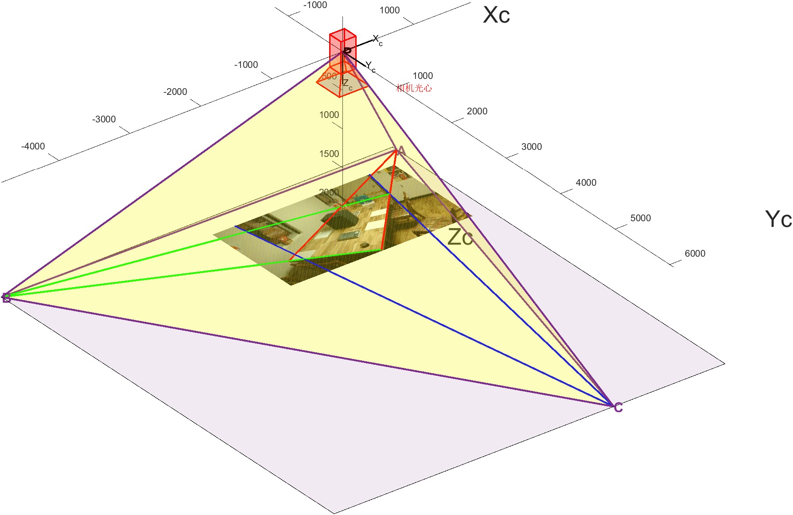
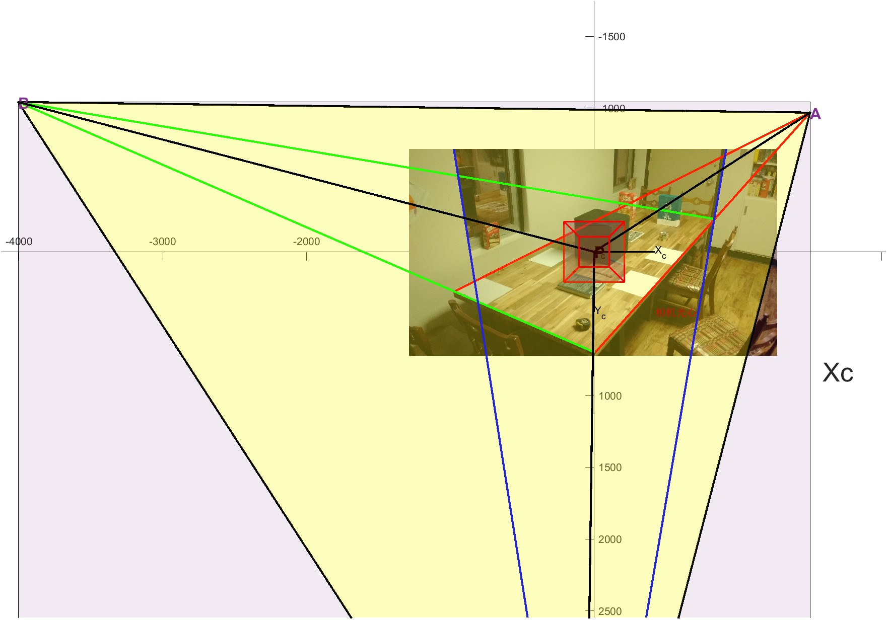
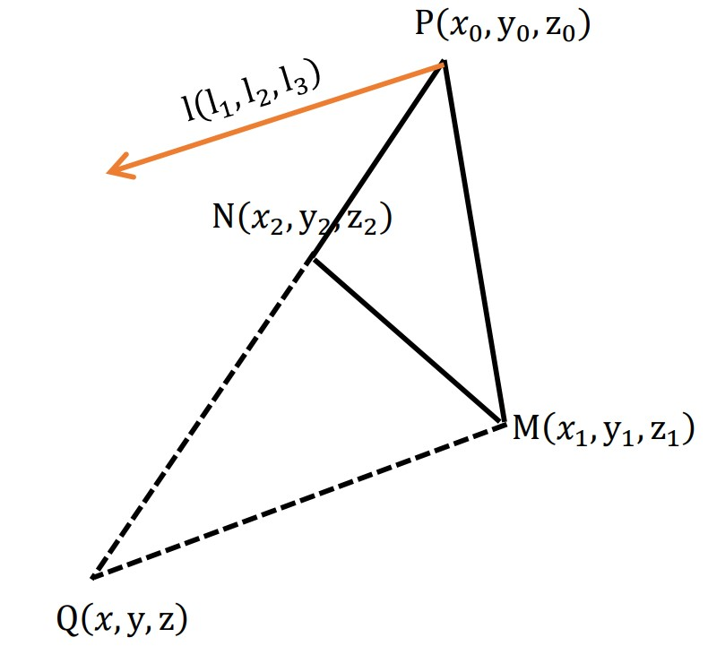

# 基于代数和几何方法的单张图像线性标定分析和实现

2022.8.24

崔星星

<cuixingxing150@gmail.com>

已知单张具有3条正交消失线的场景图像（或者至少有2条正交线，此时假设主点为图像中心），则可直接估算相机内参，另外如果已知场景图像中某些物体的实际尺寸或者坐标，则还可估计相机外参旋转矩阵 $R$ ，相机外参平移向量 $T$ ，本文以下**公式符号严格表达准确，同时提供代数和几何求解方法，代码实现可靠。**

在基于3个消失点坐标计算已知的情况下，可以分别通过计算相机内参 $K$ 、外参 $R$ 、 $T$ 这三个步骤逐渐恢复相机位姿。其中 $K$ 需具有焦距 $f$ ，主点 $\left(u_0 ,v_0 \right)$ 三个独立未知变量。

<a name="beginToc"></a>

## Table of Contents

[计算相机内参K](#计算相机内参k)

[计算外参旋转矩阵R](#计算外参旋转矩阵r)

[计算外参平移向量T](#计算外参平移向量t)

[References](#references)

<a name="endToc"></a>

# 计算相机内参K

- 代数方法：

单张图像场景中，三个正交的消失线方向向量 $e_1 =\left\lbrack \begin{array}{c} 1\\ 0\\ 0 \end{array}\right\rbrack ,e_2 =\left\lbrack \begin{array}{c} 0\\ 1\\ 0 \end{array}\right\rbrack ,e_3 =\left\lbrack \begin{array}{c} 0\\ 0\\ 1 \end{array}\right\rbrack$ ， 满足投影公式

 $\lambda_i \left\lbrack \begin{array}{c} x\\ 1 \end{array}\right\rbrack =K*\left\lbrack R,t\right\rbrack *\left\lbrack \begin{array}{c} e_i \\ 0 \end{array}\right\rbrack$ ,                                                      (1)

注意位于无限远处的消失点齐次坐标是 $\left\lbrack \begin{array}{c} e_i \\ 0 \end{array}\right\rbrack$ .整理上式，得：

 $e_i =\lambda_i R^T K^{-1} \left\lbrack \begin{array}{c} x\\ 1 \end{array}\right\rbrack$ ，                                                             (2)

又由正交性约束,有 ${e_i }^T e_j =0$ ,得：

 ${{\left\lbrack \begin{array}{c} x\\ 1 \end{array}\right\rbrack }_i }^T K^{-T} K^{-1} {\left\lbrack \begin{array}{c} x\\ 1 \end{array}\right\rbrack }_j =0$ ,                                                        (3)

K的求解通过(3)求解，实现为calIntrinsicFrom3VanishingPts.m函数。

- 几何方法：


四面体PABC为直角四面体（顶点P为互相垂直的三条棱线经过），底面三角形ABC为像平面，A,B,C为图像平面的三个消失点坐标，其中z值为 $f$ ，P点为相机光心，P点到底面ABC的距离为焦距 $f$ ，垂足为底面三角形ABC的垂心，垂心坐标为相机主点 $O_c \left(u_0 ,v_0 \right)$ .

详细几何分析见calIntrinsicGeometricAnalysis.mlx，实现见calTritetrahedron.m函数。

# 计算外参旋转矩阵R

- 代数方法：

由

 $\lambda_i {\left\lbrack \begin{array}{c} x_1 \\ x_2 \\ 1 \end{array}\right\rbrack }_i ={K*R*e}_i$ ,                                                      (4)

两边左乘 $K^{-1}$ ，

 $\lambda_i K^{-1} {\left\lbrack \begin{array}{c} x_1 \\ x_2 \\ 1 \end{array}\right\rbrack }_i ={R*e}_i$ ,                                                      (5)

注意： ${R*e}_1 =\left\lbrack r_{1,} r_2 ,r_3 \right\rbrack \left\lbrack \begin{array}{c} 1\\ 0\\ 0 \end{array}\right\rbrack =r_1$ ,得：

 ${r_i =\lambda }_i K^{-1} {\left\lbrack \begin{array}{c} x_1 \\ x_2 \\ 1 \end{array}\right\rbrack }_i$ ，(其中 $\lambda_i$ 可以通过 $\left\|r_i \right\|=1$ 约束求解，这里 $r_i$ 为外参旋转矩阵的第 $i$ 列)

- 几何方法：

 $r_i =\frac{\vec{P{\mathrm{V}}_i } }{\left\|\vec{P{\mathrm{V}}_i } \right\|}$ ，(其中 ${\mathrm{V}}_i$ 为消失点， $\vec{P{\mathrm{V}}_i }$ 为相机光心到像平面消失点的三维方向矢量也即空间消失线的三维方向矢量！)

# 计算外参平移向量T

- 代数方法：

这里边计算边分析推导：

```matlab
syms f u0 v0
syms X [3,1]
syms x [2,1]
syms R [3,3]
syms t [3,1]

```

 $$ \lambda_i {\left\lbrack \begin{array}{c} x\\ 1 \end{array}\right\rbrack } =K*\left\lbrack R,t\right\rbrack *{\left\lbrack \begin{array}{c} X\\ 1 \end{array}\right\rbrack }_i $$

展开，写成标量形式，即 $\lambda_i \left\lbrack \begin{array}{c} x_1 \\ x_2 \\ 1 \end{array}\right\rbrack =\left\lbrack \begin{array}{ccc} f & 0 & u_0 \\ 0 & f & v_0 \\ 0 & 0 & 1 \end{array}\right\rbrack *\left\lbrack \begin{array}{cccc} R_{11}  & R_{12}  & R_{13}  & t_1 \\ R_{21}  & R_{22}  & R_{23}  & t_2 \\ R_{31}  & R_{32}  & R_{33}  & t_3  \end{array}\right\rbrack *\left\lbrack \begin{array}{c} X_1 \\ X_2 \\ X_3 \\ 1 \end{array}\right\rbrack$

其中内参矩阵 $K$ ：

```matlab
K = [f,0,u0;0,f,v0;0,0,1]
```

K =
 $\displaystyle \left(\begin{array}{ccc} f & 0 & u_0 \\ 0 & f & v_0 \\ 0 & 0 & 1 \end{array}\right)$

外参旋转矩阵 $R$ ：

```matlab
R
```

R =
 $\displaystyle \left(\begin{array}{ccc} R_{1,1}  & R_{1,2}  & R_{1,3} \\ R_{2,1}  & R_{2,2}  & R_{2,3} \\ R_{3,1}  & R_{3,2}  & R_{3,3}  \end{array}\right)$

外参平移向量 $t$ ：

```matlab
t
```

t =
 $\displaystyle \left(\begin{array}{c} t_1 \\ t_2 \\ t_3  \end{array}\right)$

世界坐标点 $X$ ：

```matlab
X
```

X =
 $\displaystyle \left(\begin{array}{c} X_1 \\ X_2 \\ X_3  \end{array}\right)$

像点坐标 $x$ ：

```matlab
x
```

x =
 $\displaystyle \left(\begin{array}{c} x_1 \\ x_2  \end{array}\right)$

```matlab
express1 = K*[R,t]*[X;1]
```

express1 =
 $\displaystyle \left(\begin{array}{c} f\,t_1 +t_3 \,u_0 +X_1 \,{\left(R_{1,1} \,f+R_{3,1} \,u_0 \right)}+X_2 \,{\left(R_{1,2} \,f+R_{3,2} \,u_0 \right)}+X_3 \,{\left(R_{1,3} \,f+R_{3,3} \,u_0 \right)}\\ f\,t_2 +t_3 \,v_0 +X_1 \,{\left(R_{2,1} \,f+R_{3,1} \,v_0 \right)}+X_2 \,{\left(R_{2,2} \,f+R_{3,2} \,v_0 \right)}+X_3 \,{\left(R_{2,3} \,f+R_{3,3} \,v_0 \right)}\\ t_3 +R_{3,1} \,X_1 +R_{3,2} \,X_2 +R_{3,3} \,X_3  \end{array}\right)$

```matlab
ui = express1(1)./express1(3);
vi = express1(2)./express1(3);
express2 = [ui;vi]-x
```

express2 =
 $\displaystyle \begin{array}{l} \left(\begin{array}{c} \frac{f\,t_1 +t_3 \,u_0 +X_1 \,{\left(R_{1,1} \,f+R_{3,1} \,u_0 \right)}+X_2 \,{\left(R_{1,2} \,f+R_{3,2} \,u_0 \right)}+X_3 \,{\left(R_{1,3} \,f+R_{3,3} \,u_0 \right)}}{\sigma_1 }-x_1 \\ \frac{f\,t_2 +t_3 \,v_0 +X_1 \,{\left(R_{2,1} \,f+R_{3,1} \,v_0 \right)}+X_2 \,{\left(R_{2,2} \,f+R_{3,2} \,v_0 \right)}+X_3 \,{\left(R_{2,3} \,f+R_{3,3} \,v_0 \right)}}{\sigma_1 }-x_2  \end{array}\right)\\\mathrm{}\\\textrm{where}\\\mathrm{}\\\;\;\sigma_1 =t_3 +R_{3,1} \,X_1 +R_{3,2} \,X_2 +R_{3,3} \,X_3 \end{array}$

把 $t_1 ,t_2 ,t_3$ 从上述公式独立出来，令express2=0，重新整理可得到下式：

 $\left\lbrack \begin{array}{ccc} f & 0 & u_0 -x_1 \\ 0 & f & v_0 -x_2  \end{array}\right\rbrack \left\lbrack \begin{array}{c} t_1 \\ t_2 \\ t_3  \end{array}\right\rbrack =\left\lbrack \begin{array}{c} x_1 \left(R_{3,1} X_1 +R_{3,2} X_2 +R_{3,3} X_3 \right)-X_1 \left(R_{1,1} f+R_{3,1} u_0 \right)-X_2 \left(R_{1,2} f+R_{3,2} u_0 \right)-X_3 \left(R_{1,3} f+R_{3,3} u_0 \right)\\ x_2 \left(R_{3,1} X_1 +R_{3,2} X_2 +R_{3,3} X_3 \right)-X_1 \left(R_{2,1} f+R_{3,1} v_0 \right)-X_2 \left(R_{2,2} f+R_{3,2} v_0 \right)-X_3 \left(R_{2,3} f+R_{3,3} v_0 \right) \end{array}\right\rbrack$ (6a)

为便于从形式上公式简化，把上式写成如下形式：

 $\left\lbrack \begin{array}{ccc} f & 0 & u_0 -x_1 \\ 0 & f & v_0 -x_2  \end{array}\right\rbrack \left\lbrack \begin{array}{c} t_1 \\ t_2 \\ t_3  \end{array}\right\rbrack =\left\lbrack \begin{array}{c} r_3 P_w \left(x_1 -u_0 \right)-f\left(r_1 P_w \right)\\ r_3 P_w \left(x_2 -v_0 \right)-f\left(r_2 P_w \right) \end{array}\right\rbrack$ ，                                           (6b)

其中： $r_i =\left\lbrack R_{i,1} ,R_{i,2} ,R_{i,3} \right\rbrack ,P_w =\left\lbrack \begin{array}{c} X_1 \\ X_2 \\ X_3  \end{array}\right\rbrack$ ,其余都为标量值。工程上计算直接使用(6a)式，svd求解即可。

- 几何方法：



Fig1.实际立体图（相机像素坐标系下）


Fig2.实际立体成像图（相机像素坐标系下）



Fig3.实际俯视图（相机像素坐标系下）

**数学背景**：已知空间中三角形 $\bigtriangleup \textrm{PMN}$ 的三个顶点坐标分别为 $P\left(x_0 ,y_0 ,z_0 \right),M\left(x_1 ,y_1 ,z_1 \right),N\left(x_2 ,y_2 ,z_2 \right)$ ，该三角形所在平面为 $\psi$ ，位于该平面内过一顶点P的方向向量为 $l=\left(l_1 ,l_2 ,l_3 \right)$ ，该向量不与此三角形任何边平行/重合，则过点M且平行于方向向量 $l$ 的直线 $\textrm{MQ}$ 必与 $\textrm{PN}$ 所在直线相交，交点为 $Q\left(x,y,z\right)$ ，其示意图和解析解如下：



Fig4.求解Q点示意图

由已知平行性条件，可得下面共面的两条空间直线方程组：

 $$ \left\lbrace \begin{array}{ll} \frac{x-x_1 }{l_1 }=\frac{y-y_1 }{l_2 }=\frac{z-z_1 }{l_3 } & \\ \frac{x-x_2 }{x_2 -x_0 }=\frac{x-x_2 }{y_2 -y_0 }=\frac{x-x_2 }{z_2 -z_0 } &  \end{array}\right. $$

```matlab
syms l1 l2 l3 x0 y0 z0 x1 y1 z1 x2 y2 z2 x y z real
equ1 = (x-x1)./l1==(y-y1)./l2;
equ2 = (x-x1)./l1==(z-z1)./l3;
equ3 = (x-x2)./(x2-x0)==(y-y2)./(y2-y0);
equ4 = (x-x2)./(x2-x0)==(z-z2)./(z2-z0);
[x,y] =solve([equ1,equ3],[x,y]);
z = simplify(l3*(x-x1)/l1+z1);
Q = [x,y,z] 
```

Q =
 $\displaystyle \begin{array}{l} \left(\begin{array}{ccc} \sigma_1  & \frac{l_2 \,x_1 \,y_0 +l_2 \,x_0 \,y_2 -l_2 \,x_2 \,y_0 -l_2 \,x_1 \,y_2 -l_1 \,y_0 \,y_1 +l_1 \,y_1 \,y_2 }{l_2 \,x_0 -l_2 \,x_2 -l_1 \,y_0 +l_1 \,y_2 } & z_1 -\frac{l_3 \,{\left(x_1 -\sigma_1 \right)}}{l_1 } \end{array}\right)\\\mathrm{}\\\textrm{where}\\\mathrm{}\\\;\;\sigma_1 =\frac{l_2 \,x_0 \,x_1 -l_2 \,x_1 \,x_2 -l_1 \,x_0 \,y_1 +l_1 \,x_0 \,y_2 -l_1 \,x_2 \,y_0 +l_1 \,x_2 \,y_1 }{l_2 \,x_0 -l_2 \,x_2 -l_1 \,y_0 +l_1 \,y_2 }\end{array}$

实现函数为calQcoord.m。

主要利用相似三角形计算，由Fig2中成像过程，可知 $\bigtriangleup \textrm{PMQ}\sim \bigtriangleup {\textrm{PM}}_w N_w$ ，点 $M_w$ 、 $N_w$ 分别为图像中 $M$ 、 $N$ 点对应世界坐标系中的点，因在世界坐标系中 $\left\|\textrm{MN}\right\|$ 模已知，故可求解 $M$ 点的深度，从而推出外参 $T$ ，详细见demoOneImgCalibrate.m实现。

# References

[1] R. Cipolla, T. Drummond and D. Robertson,Camera calibration from vanishing points in images of architectural scenes,1999

[2] Berthold K.P. Horn,Tsai’s camera calibration method revisited,2000

[3] Radu Orghidan,Joaquim Salvi, Camera calibration using two or three vanishing points,2012.
