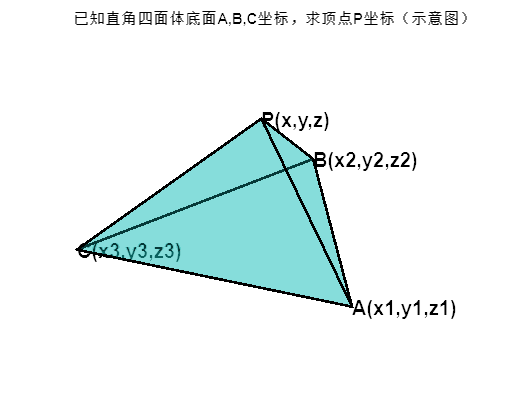

[toc]
# 基于几何方法的单张图像标定之相机内参数学分析

<center> cuixingxing150@gmail.com</center> <br>

任意给定不共线的三个空间点坐标，是否存在以该三个点为底面的直角四面体（顶点三条棱线互相垂直的四面体）？如果存在，是否除了以底面对称外的唯一一个顶点坐标？该顶点到底面的垂足是否是底面三角形的垂心？
结论：不一定存在；若底面三角形垂心位于三角形内(即锐角三角形)，则存在唯一的顶点坐标，该底面垂心即顶点到底面垂足，否在不存在。重点参考文后references.<br>

**以下提供三种方式求解直角四面体的高度h，分别为数值求解、代数求解、利用直角四面体性质求解（推荐）。**
  
## 示意图

已知直角四面体PABC，共顶点P的三条棱线PA,PB,PC互相垂直，求点P到底面ABC的距离d。（点P到底面ABC的垂足即三角形ABC的垂心）
```matlab
% 模拟四面体的四个顶点坐标[x,y,z],任意人为给定的
vertices = [0,2,2;% A 
    0,0,0;% B
    2,2*sqrt(3),0;% C
    -2,2*sqrt(3),0];% 顶点P，底边点A,B,C顺序
T = [1,2,3,4];
tetramesh(T,vertices,FaceAlpha=0.3,LineWidth=2);
text(vertices(:,1),vertices(:,2),vertices(:,3),...
    {'P(x,y,z)','A(x1,y1,z1)','B(x2,y2,z2)','C(x3,y3,z3)'},...
    FontWeight='bold',FontSize=15)
axis off;
title("已知直角四面体底面A,B,C坐标，求顶点P坐标（示意图）")
```


## 数值求解
用A,B,C数值直接代入求解

```matlab
syms  x y z
assume([ x y z],'real')
assumeAlso(z,'positive')

pointP = [x,y,z];
pointA = vertices(2,:);
pointB = vertices(3,:);
pointC = vertices(4,:);

PA = pointA-pointP;
PB = pointB-pointP;
PC = pointC-pointP;
AB = pointB- pointA;
AC = pointC- pointA;
BC = pointC- pointB;
 
equ1 = dot(PA,PA)+dot(PB,PB)==dot(AB,AB);% 勾股定理
equ2 = dot(PA,PA)+dot(PC,PC)==dot(AC,AC);% 勾股定理
equ3 = dot(PB,PB)+dot(PC,PC)==dot(BC,BC);% 勾股定理
sol1 = solve([equ1,equ2,equ3],[x,y,z],ReturnConditions=true);% 求解方程组
```

顶点P的坐标为：

```matlab
P = simplify([sol1.x(1),sol1.y(1),sol1.z(1)])
```

P = 

   

```matlab

% 绘制新的直角四面体
vertices(1,:)=P;% 更新顶点P坐标
T = [1,2,3,4];
tetramesh(T,vertices,FaceAlpha=0.3,LineWidth=2)
text(vertices(:,1),vertices(:,2),vertices(:,3),...
    {'P(x,y,z)','A(x1,y1,z1)','B(x2,y2,z2)','C(x3,y3,z3)'},...
    FontWeight='bold',FontSize=15)
axis off
```


求顶点P到底面距离C，其中底面法向量为n

```matlab
n = cross(AB,AC);
C = abs(dot(PA,n./norm(n)));
h = simplify(subs(C,[x,y,z],[sol1.x(1),sol1.y(1),sol1.z(1)]))
```

h = 

   

```matlab
% plot orthoCenter
orthoCenter = getOrthoCenter(pointA(1:2),pointB(1:2),pointC(1:2));
orthoCenter = repmat([orthoCenter,0],4,1);
hold on;
for i = 1:4
    currLine = [vertices(i,:);
        orthoCenter(i,:)];
    plot3(currLine(:,1),currLine(:,2),currLine(:,3),"--",LineWidth=2)
end
scatter3(orthoCenter(1,1),orthoCenter(1,2),orthoCenter(1,3),"filled",MarkerFaceColor="red")
text(orthoCenter(1,1),orthoCenter(1,2),orthoCenter(1,3),"Oc",FontSize=15,FontWeight="bold")
title("修正后的标准直角四面体（P为直角顶点）")
```


## 代数求解
给定底面任意三个点坐标A,B,C，求直角四面体的顶点坐标P。
```matlab
syms  x y z x1 y1 z1 x2 y2 z2 x3 y3 z3 xo yo zo
assume([x y z x1 y1 z1 x2 y2 z2 x3 y3 z3 xo yo zo],'real')
% vertices and orthocenter
pointP = [x,y,z];
pointA = [x1,y1,z1];
pointB = [x2,y2,z2];
pointC = [x3,y3,z3];
pointO = [xo,yo,zo]; % orthocenter of tri-ABC
% edge vector
PA = pointA-pointP;
PB = pointB-pointP;
PC = pointC-pointP;
AB = pointB- pointA;
BC = pointC- pointB;
AC = pointC- pointA;
% orthocenter vector
BO = pointO-pointB;
CO = pointO-pointC;
% 底面三角形垂心约束
equ1 = dot(BO,AC)==0;
equ2 = dot(CO,AB)==0;
equ3 = dot(BC,cross(BO,CO))==0;
% solve orthocenter of base triangule ABC, direct solve
[xo_,yo_,zo_] = solve([equ1,equ2,equ3],[xo,yo,zo])
```
xo_  = <br>

   $$ \frac{y_1 \,{y_2 }^2 -{y_1 }^2 \,y_2 -y_1 \,{y_3 }^2 +{y_1 }^2 \,y_3 +y_2 \,{y_3 }^2 -{y_2 }^2 \,y_3 -x_1 \,x_2 \,y_1 +x_1 \,x_2 \,y_2 +x_1 \,x_3 \,y_1 -x_1 \,x_3 \,y_3 -x_2 \,x_3 \,y_2 +x_2 \,x_3 \,y_3 -y_1 \,z_1 \,z_2 +y_1 \,z_1 \,z_3 +y_2 \,z_1 \,z_2 -y_2 \,z_2 \,z_3 -y_3 \,z_1 \,z_3 +y_3 \,z_2 \,z_3 }{x_1 \,y_2 -x_2 \,y_1 -x_1 \,y_3 +x_3 \,y_1 +x_2 \,y_3 -x_3 \,y_2 }$$ 

yo_ = 

   $$ -\frac{x_1 \,{x_2 }^2 -{x_1 }^2 \,x_2 -x_1 \,{x_3 }^2 +{x_1 }^2 \,x_3 +x_2 \,{x_3 }^2 -{x_2 }^2 \,x_3 -x_1 \,y_1 \,y_2 +x_1 \,y_1 \,y_3 +x_2 \,y_1 \,y_2 -x_2 \,y_2 \,y_3 -x_3 \,y_1 \,y_3 +x_3 \,y_2 \,y_3 -x_1 \,z_1 \,z_2 +x_1 \,z_1 \,z_3 +x_2 \,z_1 \,z_2 -x_2 \,z_2 \,z_3 -x_3 \,z_1 \,z_3 +x_3 \,z_2 \,z_3 }{x_1 \,y_2 -x_2 \,y_1 -x_1 \,y_3 +x_3 \,y_1 +x_2 \,y_3 -x_3 \,y_2 }$$ 

zo_ = 

   $$0$$ 


```matlab
AO = pointO-pointA;
BO = pointO-pointB;
```
Set $a=\left\|\textrm{PA}\right\|,b=\left\|\textrm{PB}\right\|,c=\left\|\textrm{PC}\right\|$

```matlab
syms a b c real positive
equs1 = a.^2+b.^2==dot(AB,AB);
equs2 = b.^2+c.^2==dot(BC,BC);
equs3 = a.^2+c.^2==dot(AC,AC);
[a,b,c] = solve([equs1,equs2,equs3],[a,b,c],IgnoreAnalyticConstraints=true)% An acute triangle formed by the three points of ABC is valid
```

```text
Warning: Solutions are only valid under certain conditions. To include parameters and conditions in the solution, specify the 'ReturnConditions' value as 'true'.
```

a = 

   $$ \sqrt{x_2 \,x_3 -x_1 \,x_3 -x_1 \,x_2 -y_1 \,y_2 -y_1 \,y_3 +y_2 \,y_3 -z_1 \,z_2 -z_1 \,z_3 +z_2 \,z_3 +{x_1 }^2 +{y_1 }^2 +{z_1 }^2 }$$

b = 

   $$ \sqrt{x_1 \,x_3 -x_1 \,x_2 -x_2 \,x_3 -y_1 \,y_2 +y_1 \,y_3 -y_2 \,y_3 -z_1 \,z_2 +z_1 \,z_3 -z_2 \,z_3 +{x_2 }^2 +{y_2 }^2 +{z_2 }^2 }$$

c = 

   $$\sqrt{x_1\,x_2-x_1\,x_3-x_2\,x_3+y_1\,y_2-y_1\,y_3-y_2\,y_3+z_1\,z_2-z_1\,z_3-z_2\,z_3+{x_3}^2+{y_3}^2+{z_3}^2}$$

```matlab
h = subs(sqrt(b^2-dot(BO,BO)),[xo,yo,zo],[xo_,yo_,zo_]) % altitude of PO, P点垂足即为O点，也即底面三角形垂心
```

h = 

$$\displaystyle \begin{array}{l}
\sqrt{x_1 \,x_3 -{{\left(x_2 -\frac{y_1 \,{y_2 }^2 -{y_1 }^2 \,y_2 -y_1 \,{y_3 }^2 +{y_1 }^2 \,y_3 +y_2 \,{y_3 }^2 -{y_2 }^2 \,y_3 -x_1 \,x_2 \,y_1 +x_1 \,x_2 \,y_2 +x_1 \,x_3 \,y_1 -x_1 \,x_3 \,y_3 -x_2 \,x_3 \,y_2 +x_2 \,x_3 \,y_3 -y_1 \,z_1 \,z_2 +y_1 \,z_1 \,z_3 +y_2 \,z_1 \,z_2 -y_2 \,z_2 \,z_3 -y_3 \,z_1 \,z_3 +y_3 \,z_2 \,z_3 }{\sigma_1 }\right)}}^2 -x_1 \,x_2 -{{\left(y_2 +\frac{x_1 \,{x_2 }^2 -{x_1 }^2 \,x_2 -x_1 \,{x_3 }^2 +{x_1 }^2 \,x_3 +x_2 \,{x_3 }^2 -{x_2 }^2 \,x_3 -x_1 \,y_1 \,y_2 +x_1 \,y_1 \,y_3 +x_2 \,y_1 \,y_2 -x_2 \,y_2 \,y_3 -x_3 \,y_1 \,y_3 +x_3 \,y_2 \,y_3 -x_1 \,z_1 \,z_2 +x_1 \,z_1 \,z_3 +x_2 \,z_1 \,z_2 -x_2 \,z_2 \,z_3 -x_3 \,z_1 \,z_3 +x_3 \,z_2 \,z_3 }{\sigma_1 }\right)}}^2 -x_2 \,x_3 -y_1 \,y_2 +y_1 \,y_3 -y_2 \,y_3 -z_1 \,z_2 +z_1 \,z_3 -z_2 \,z_3 +{x_2 }^2 +{y_2 }^2 }\\
\mathrm{}\\
\textrm{where}\\
\mathrm{}\\
\sigma_1 =x_1 \,y_2 -x_2 \,y_1 -x_1 \,y_3 +x_3 \,y_1 +x_2 \,y_3 -x_3 \,y_2 
\end{array}$$


```matlab
normVec = cross(AB,AC)./norm(cross(AB,AC));
n=h.*normVec; % OP vector
x_uint = sym([1,0,0]);
y_uint = sym([0,1,0]);
z_uint = sym([0,0,1]);
x = xo_+dot(n,x_uint);
y = yo_+dot(n,y_uint);
z = zo_+dot(n,z_uint);
```
顶点P的解析解坐标为：
```matlab
P_coordinate = [x,y,z]
```

P_coordinate = 

   $$\begin{array}{l}\left(\begin{array}{ccc}\sigma_3+\frac{\sigma_1\,\sigma_5}{\sigma_2}&-\sigma_4-\frac{\sigma_1\,\sigma_6}{\sigma_2}&\frac{\sigma_1\,\sigma_7}{\sigma_2}\end{array}\right)\\\\\textrm{where}\\\ \sigma_1=\overline{\sqrt{x_1\,x_3-{{\left(x_2-\sigma_3\right)}}^2-x_1\,x_2-{{\left(y_2+\sigma_4\right)}}^2-x_2\,x_3-y_1\,y_2+y_1\,y_3-y_2\,y_3-z_1\,z_2+z_1\,z_3-z_2\,z_3+{x_2}^2+{y_2}^2}}\\\ \sigma_2=\sqrt{{\left|\sigma_7\right|}^2+{\left|\sigma_6\right|}^2+{\left|\sigma_5\right|}^2}\\\ \sigma_3=\frac{y_1\,{y_2}^2-{y_1}^2\,y_2-y_1\,{y_3}^2+{y_1}^2\,y_3+y_2\,{y_3}^2-{y_2}^2\,y_3-x_1\,x_2\,y_1+x_1\,x_2\,y_2+x_1\,x_3\,y_1-x_1\,x_3\,y_3-x_2\,x_3\,y_2+x_2\,x_3\,y_3-y_1\,z_1\,z_2+y_1\,z_1\,z_3+y_2\,z_1\,z_2-y_2\,z_2\,z_3-y_3\,z_1\,z_3+y_3\,z_2\,z_3}{\sigma_8}\\\ \sigma_4=\frac{x_1\,{x_2}^2-{x_1}^2\,x_2-x_1\,{x_3}^2+{x_1}^2\,x_3+x_2\,{x_3}^2-{x_2}^2\,x_3-x_1\,y_1\,y_2+x_1\,y_1\,y_3+x_2\,y_1\,y_2-x_2\,y_2\,y_3-x_3\,y_1\,y_3+x_3\,y_2\,y_3-x_1\,z_1\,z_2+x_1\,z_1\,z_3+x_2\,z_1\,z_2-x_2\,z_2\,z_3-x_3\,z_1\,z_3+x_3\,z_2\,z_3}{\sigma_8}\\\ \sigma_5={\left(y_1-y_2\right)}\,{\left(z_1-z_3\right)}-{\left(y_1-y_3\right)}\,{\left(z_1-z_2\right)}\\\ \sigma_6={\left(x_1-x_2\right)}\,{\left(z_1-z_3\right)}-{\left(x_1-x_3\right)}\,{\left(z_1-z_2\right)}\\\ \sigma_7={\left(x_1-x_2\right)}\,{\left(y_1-y_3\right)}-{\left(x_1-x_3\right)}\,{\left(y_1-y_2\right)}\\\ \sigma_8=x_1\,y_2-x_2\,y_1-x_1\,y_3+x_3\,y_1+x_2\,y_3-x_3\,y_2\end{array}$$


示例：对于底面三角形ABC的三个顶点坐标分别为(0,0,0),  (2,2*sqrt(3),0),  (-2,2*sqrt(3),0)，然后我可以通过上式直接计算获取高度h和P点坐标。

```matlab
ABC = vertices(2:end,:);% 底边点A,B,C顺序
values = ABC';
values = values(:);
h = simplify(subs(h,[x1 y1 z1 x2 y2 z2 x3 y3 z3],values'))
```

h = 

   $\frac{2\,\sqrt{6}}{3}$

```matlab
P_coord = simplify(subs(P_coordinate,[x1 y1 z1 x2 y2 z2 x3 y3 z3],values'))
```

P_coord = 

   $\left(\begin{array}{ccc}0&\frac{4\,\sqrt{3}}{3}&\frac{2\,\sqrt{6}}{3}\end{array}\right)$

## 利用直角四面体性质求解（推荐）

由于数值求解具有单一性，解析求解的结果过于复杂。故采用直角四面体的性质求解。

$$v=\frac{1}{3}{*S}_{\bigtriangleup\textrm{ABC}}*h=\frac{1}{6}*a*b*c$$


其中： $\left\|\textrm{PA}\right\|,b=\left\|\textrm{PB}\right\|,c=\left\|\textrm{PC}\right\|$ ， $v$ 为四面体体积， $S_{\bigtriangleup \textrm{ABC}}$ 为底面三角形面积。

```matlab
syms a b c
assume(a>0 & b>0 & c>0)
equ1 = a.^2+b.^2==dot(AB,AB);
equ2 = a.^2+c.^2==dot(AC,AC);
equ3 = b.^2+c.^2==dot(BC,BC);
[a,b,c,parameters,cond] = solve([equ1,equ2,equ3],[a,b,c],'ReturnConditions',true);
S_ABC = 0.5*norm(cross(AB,AC));
h = 0.5*a*b*c./S_ABC
```

h = 

   $\frac{\sqrt{x_1\,x_2-x_1\,x_3-x_2\,x_3+y_1\,y_2-y_1\,y_3-y_2\,y_3+z_1\,z_2-z_1\,z_3-z_2\,z_3+{x_3}^2+{y_3}^2+{z_3}^2}\,\sqrt{x_2\,x_3-x_1\,x_3-x_1\,x_2-y_1\,y_2-y_1\,y_3+y_2\,y_3-z_1\,z_2-z_1\,z_3+z_2\,z_3+{x_1}^2+{y_1}^2+{z_1}^2}\,\sqrt{x_1\,x_3-x_1\,x_2-x_2\,x_3-y_1\,y_2+y_1\,y_3-y_2\,y_3-z_1\,z_2+z_1\,z_3-z_2\,z_3+{x_2}^2+{y_2}^2+{z_2}^2}}{\sqrt{{\left|{\left(x_1-x_2\right)}\,{\left(y_1-y_3\right)}-{\left(x_1-x_3\right)}\,{\left(y_1-y_2\right)}\right|}^2+{\left|{\left(x_1-x_2\right)}\,{\left(z_1-z_3\right)}-{\left(x_1-x_3\right)}\,{\left(z_1-z_2\right)}\right|}^2+{\left|{\left(y_1-y_2\right)}\,{\left(z_1-z_3\right)}-{\left(y_1-y_3\right)}\,{\left(z_1-z_2\right)}\right|}^2}}$

```matlab
baseVertices = vertices(2:end,:)';

altitude = simplify(subs(h,[x1 y1 z1 x2 y2 z2 x3 y3 z3],baseVertices(:)'))
```
altitude = 

   $\frac{2\,\sqrt{6}}{3}$

# References
[1] [直角四面体Trirectangular_tetrahedron维基百科](https://en.wikipedia.org/wiki/Trirectangular_tetrahedron)<br>
[2] [直角四面体顶点唯一性分析和证明](https://math.stackexchange.com/questions/547717/trirectangular-tetrahedron-uniqueness-of-vertex-given-base)<br>
[3] [垂心组orthocenter system维基百科](https://en.wikipedia.org/wiki/Orthocentric_system)<br>


