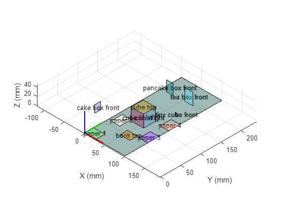
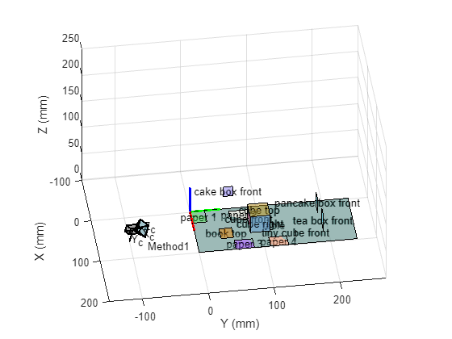
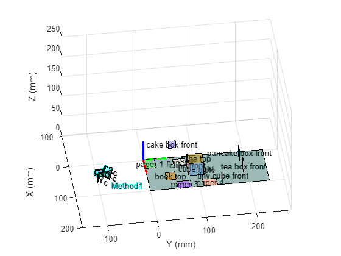
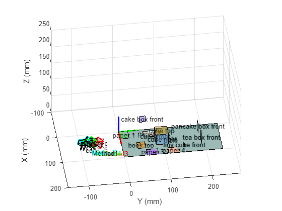
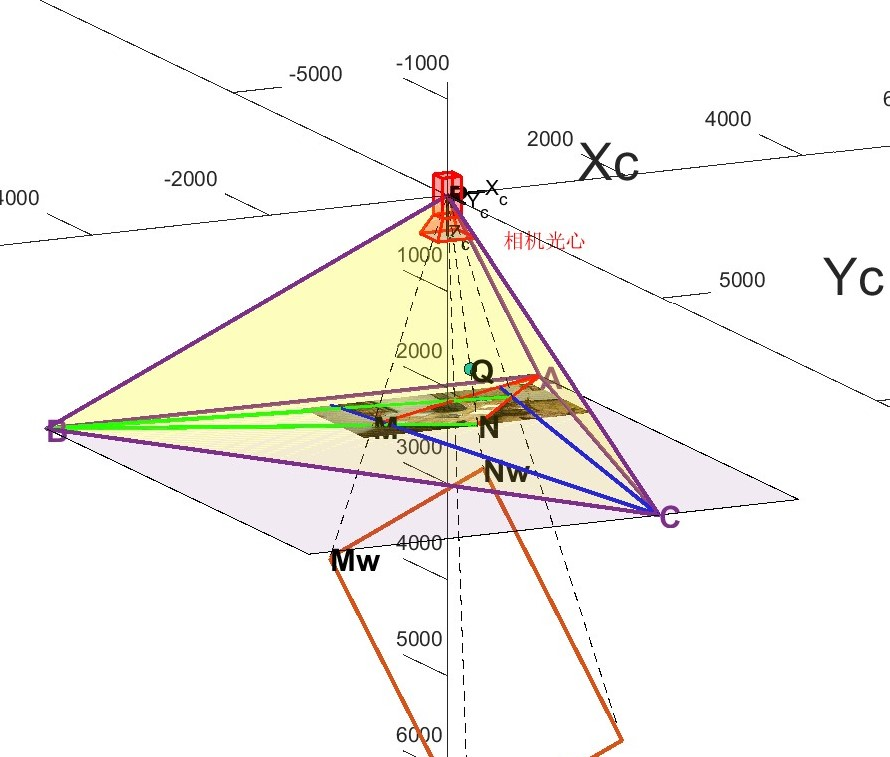
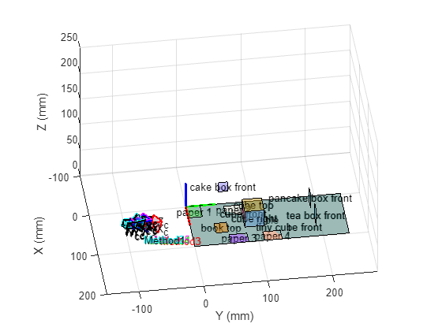

[toc]
# Implementation and visualisation of multiple classical calibration methods based on a single image
# 基于单张图像的多种经典标定方法实现与可视化
<center> cuixingxing150@gmail.com</center>


Implementation and visualisation of multiple classical linear calibration methods for a single image.This repo aims to provide as many single image calibration methods as possible for linear [pinhole cameras](https://en.wikipedia.org/wiki/Pinhole_camera_model#The_geometry_and_mathematics_of_the_pinhole_camera), solving for camera intrinsic and extrinsic parameters based on known 3D-2D or other auxiliary conditions, and presenting them in the most intuitive way,deepening the understanding of the camera imaging process.


仅使用单张图像完成多种经典标定方法实现与可视化。本仓库旨在提供尽可能多的单张图像标定方法，线性[针孔相机](https://en.wikipedia.org/wiki/Pinhole_camera_model#The_geometry_and_mathematics_of_the_pinhole_camera)，根据已知的3D-2D或其他辅助条件求解相机内参和外参，并以最直观的方式呈现，加深对相机成像过程的理解。


## Preliminary materials

```matlab
srcImage = imread('./images/CameraCalP1.jpg');
imshow(srcImage);
title("source image")
```


### step1: Known 3D-2D correspondence points (all methods required)


In the *plotGroundTruth3D* function there is a defined set of known 3D points for each object plotted in 3D space, colours, labels.The short red, green and blue lines at the corner points of the diagram are the X,Y,Z axes of a custom world coordinate system.


```matlab
[figObj,worldPoints,objectLabels,colors] = plotGroundTruth3D();%GroundTruth figure
```





There are various ways to get the 2D pixel points corresponding to the 3D points in the `worldPoints` above. This example shows how easy it is to draw a quadrilateral interactively to get the 2D pixel points `imagePoints`.


```matlab
if ~isfile("data/imgPts.mat")
    % Interaction drawing, press any key to confirm and continue.
    % Refer to the name of the "GroundTruth figure", the colours correspond
    % to the drawing.For more interactions see the official built-in
    % `drawpolygon` function.
    figure(Name="interactive draw object quadrilateral");imshow(srcImage);
    imagePoints = drawImagePoints(objectLabels,colors);
    save data/imgPts.mat imagePoints
else
    load data/imgPts.mat
end
```

### step2: Find Camera Principle Point(Not all methods required)<a name="1.2"></a>


The coordinates of the vertical centre of a triangle formed by the intersection of three sets of mutually orthogonal parallel lines in space, i.e. the intersection of three sets of vanishing lines (vanishing points) in the corresponding image, are the **camera principle point**.This example program draws red, green and blue lines for each of these three sets of orthogonal vanishing lines.For background material see the Geometric Solution Analysis section in *calExtrinsicAnalysis.mlx* in this repo.


If an image is visually very difficult to find three pairs of orthogonal vanishing lines, then at least two pairs of orthogonal lines should be found, assuming in addition that the  camera principle point is at the centre of the image.Then the intersection of the third set of orthogonal vanishing lines (i.e. the third vanishing point) can  be deduced from [orthocenter system](https://en.wikipedia.org/wiki/Orthocentric_system) theorem and the rest of the steps remain the same.See the *calIntrinsicGeometricAnalysis.mlx* section of this repo for analysis related to the algebraic solution of the orthocenter coordinates.


```matlab
figure(Name="Draw three sets of orthogonal parallel lines");
imshow(srcImage);
if ~isfile("data/parallel.mat")
    % Interaction drawing, press any key to confirm and continue
    % l11 parallel to l12 in space
    l11 = drawline(Color=[1,0,0],Label="group 1");pause;
    l12 = drawline(Color=[1,0,0],Label="group 1");pause;

    % l21 parallel to l22 in space
    l21 = drawline(Color=[0,1,0],Label="group 2");pause;
    l22 = drawline(Color=[0,1,0],Label="group 2");pause;
    
    % l31 parallel to l32 in space
    l31 = drawline(Color=[0,0,1],Label="group 3");pause;
    l32 = drawline(Color=[0,0,1],Label="group 3");pause;

    save data/parallel.mat l11 l12 l21 l22 l31 l32
else
    load data/parallel.mat
    l11.Parent = gca; l12.Parent = gca;
    l21.Parent = gca; l22.Parent = gca;
    l31.Parent = gca; l32.Parent = gca;
%     title("confirm space line parallel? press any key to confirm and continue!")
%     pause;
end
vanishingA = intersectLine(l11,l12);
vanishingB = intersectLine(l21,l22);
vanishingC = intersectLine(l31,l32);
pointsOrthoCenter = getOrthoCenter(vanishingA,vanishingB,vanishingC);
u0 = pointsOrthoCenter(1);
v0 = pointsOrthoCenter(2);

% plot vanishing lines
hold on;
vanishingPts = [vanishingA;
    vanishingB;
    vanishingC];
triShape = polyshape(vanishingPts);
plot(triShape,FaceAlpha=0.15,EdgeColor='#7E2F8E',LineWidth=2);
text(vanishingPts(:,1),vanishingPts(:,2),["A","B","C"],...
    FontSize=15,FontWeight="bold",Color='#7E2F8E')

adjustVanishingLine(l11,vanishingA);
adjustVanishingLine(l12,vanishingA);

adjustVanishingLine(l21,vanishingB);
adjustVanishingLine(l22,vanishingB);

adjustVanishingLine(l31,vanishingC);
adjustVanishingLine(l32,vanishingC);
zoom(0.1)
```


## Method1：Decompose camera projection matrix(QR decomposition)<a name="M1"></a>


The method has no special requirements and requires only a number of 3D-2D correspondence points(at least 6 pairs of non-coplanar points) in a single image to be solved, no vanishing point calculation is required.


The main algorithmic steps are:


   1.  Estimate the camera projection matrix  based on the 3D-2D points 
   1.  Decompose  $P$ into $K,R$ and $T$ ( $P=K\left\lbrack R,T\right\rbrack)$  


   -  Use the QR decomposition for the first 3 columns of the $P$ matrix into $K,R$; 
   - Calculate $T$  

$$T=K^{-1} \left\lbrack \begin{array}{c}
P_{14} \\
P_{24} \\
P_{34} 
\end{array}\right\rbrack$$

The camera intrinsic $K$ have the following form:

$$K=\left\lbrack \begin{array}{ccc}
f_x  & s & u_0 \\
0 & f_y  & v_0 \\
0 & 0 & 1
\end{array}\right\rbrack$$


```matlab
[~,intrinsicK1, extrinsicR1, extrinsicT1] = oneImageCalibrate3D(imagePoints,worldPoints);

 % 绘制相机姿态
[orientation,location] = extrinsicsToCameraPose(extrinsicR1',extrinsicT1');
figure(figObj);hold on;axis([-100,200,-150,270,0,250]);view([82,38]);
plotCamera(AbsolutePose=rigid3d(orientation,location),Size=10,...
    Color='black',AxesVisible=1,Label="M1");
```




## Method2：Decompose camera projection matrix(intrinsic and extrinsic properties)<a name="M2"></a>


The method also has no special requirements and requires only a number of 3D-2D correspondence points(at least 6 pairs of non-coplanar points) in a single image to be solved, no vanishing point calculation is required.


The main algorithmic steps are:


   1.  Estimate the camera projection matrix $P$ based on the 3D-2D points 
   1.  Decompose $P$ into $K,R$ and $T$ using Faugeras Theorem(1993). 


```matlab
% or use matlab build-in function estimateCameraMatrix function,but note that the outputs are transposed to each other and the conventions are different
cameraMatrix = estimateCameraProjectionMatrix(imagePoints,worldPoints);
[intrinsicK2,extrinsicR2,extrinsicT2] = cameraProjectionMatDecomp(cameraMatrix);

% 绘制相机姿态
[orientation,location] = extrinsicsToCameraPose(extrinsicR2',extrinsicT2');
figure(figObj);hold on;axis([-100,200,-150,270,0,250]);view([82,38]);
plotCamera(AbsolutePose=rigid3d(orientation,location),Size=10,...
    Color='cyan',AxesVisible=1,Label="M2");
```




## Method3：tsai calibration<a name="M3"></a>


For more information: Berthold K.P. Horn,Tsai’s camera calibration method revisited,2000


The camera intrinsic $K$ have the following form:


$$K=\left\lbrack \begin{array}{ccc}
f_x  & 0 & u_0 \\
0 & f_y  & v_0 \\
0 & 0 & 1
\end{array}\right\rbrack$$


```matlab
[intrinsicK3,extrinsicR3,extrinsicT3] = tsaiCalibrate(...
    imagePoints,worldPoints,[u0,v0]);

%  绘制相机姿态图
[orientation,location] = extrinsicsToCameraPose(extrinsicR3',...
    extrinsicT3');
figure(figObj);hold on;axis([-100,200,-150,270,0,250]);view([82,38]);
plotCamera(AbsolutePose=rigid3d(orientation,location),Size=10,Color='red',...
    AxesVisible=1,Label="M3");
```


## Method4：Geometric solution <a name="M4"></a>


The principal point is the orthocenter of the base triangle, the focal length is the height of the right-angled tetrahedron, the direction of the extrinsic rotation matrix is parallel to the prism of the tetrahedron, and the extrinsic translation vector is the proportion of similar triangles. For further details see *[calIntrinsicGeometricAnalysis](./calIntrinsicGeometricAnalysis.md) *and* [calExtrinsicAnalysis](./calExtrinsicAnalysis.md)*.


Note:the camera intrinsic $K$ must be in the following form:


$$K=\left\lbrack \begin{array}{ccc}
f & 0 & u_0 \\
0 & f & v_0 \\
0 & 0 & 1
\end{array}\right\rbrack$$


```matlab
pointA = [vanishingA,0];
pointB = [vanishingB,0];
pointC = [vanishingC,0];

[altitude,verticeP,orthocenter] = calTritetrahedron(pointA,pointB,pointC);
u0 = orthocenter(1,1);
v0 = orthocenter(1,2);
intrinsicK4 = [altitude,0,u0;
    0,altitude,v0;
    0,0,1];

% extrinsic params
% 在相机像素坐标系下的方向向量，也即世界坐标系中消失线（真实）在相机物理坐标系中的
% 单位方向向量
PA = (pointA-verticeP)./vecnorm(pointA-verticeP);
PB = (pointB-verticeP)./vecnorm(pointB-verticeP);
PC = (pointC-verticeP)./vecnorm(pointC-verticeP);
extrinsicR4 = [-PB',PA',-PC']; % 即世界坐标系中三个坐标轴正方向在相机物理坐标系中的表示

% 根据图像中任意选取感兴趣的一点计算到相机光心的距离，根据已知物理长度，可计算该点的平移向量
% 在这里以桌子一边的长度来求取
cornerMInCamera = [imagePoints(1,:)-[u0,v0],altitude];
cornerNInCamera = [imagePoints(2,:)-[u0,v0],altitude];
cornerMInWorld = worldPoints(1,:);
cornerNInWorld = worldPoints(2,:);

P = [0,0,0];% 光心坐标
Q = calQcoord(PB,P,cornerMInCamera,cornerNInCamera);% 查看下图中Q点位置
pixelMQLen = vecnorm(cornerMInCamera-Q);
pixelPMLen = vecnorm(cornerMInCamera-P);
worldMNLen = vecnorm(cornerMInWorld-cornerNInWorld);
worldPMLen = worldMNLen/pixelMQLen*pixelPMLen;
PM = (cornerMInCamera-P)./vecnorm(cornerMInCamera-P);
PMInWorld = worldPMLen*PM;
extrinsicT4 = PMInWorld; % M点即为定义的世界坐标系原点，故等于外参T

% 绘相机姿态图
[cameraOri,cameraLoc] = extrinsicsToCameraPose(extrinsicR4',extrinsicT4);
figure(figObj);hold on;axis([-100,200,-150,270,0,250]);view([82,38]);
plotCamera(AbsolutePose=rigid3d(cameraOri,cameraLoc),Size=10,Color='green',...
    AxesVisible=1,Label="M4");
```





```matlab
% plot in 3D view(相机像素坐标系下)
plotCameraProjection3D(srcImage,l11,l12,l21,l22,l31,l32,vanishingPts, ...
    intrinsicK4,extrinsicR4,extrinsicT4,worldPoints,cornerMInCamera,...
    cornerNInCamera,P,Q);
```




## Method5：Algebraic solution<a name="M5"></a>


For more information,see *[calExtrinsicAnalysis](./calExtrinsicAnalysis.md).*


Note: the camera intrinsic  must be also in the following form:


$$K=\left\lbrack \begin{array}{ccc}
f & 0 & u_0 \\
0 & f & v_0 \\
0 & 0 & 1
\end{array}\right\rbrack$$


```matlab
intrinsicK5 = calIntrinsicFrom3VanishingPts([vanishingA,1],[vanishingB,1],[vanishingC,1]);

% 求旋转矩阵R
r1 = intrinsicK5\[vanishingA,1]';
r2 = intrinsicK5\[vanishingB,1]';
r3 = intrinsicK5\[vanishingC,1]';
r1 = r1./vecnorm(r1);% 注意消失线PA对应空间的线方向
r2 = r2./vecnorm(r2);% 注意消失线PB对应空间的线方向
r3 = r3./vecnorm(r3);% 注意消失线PC对应空间的线方向
extrinsicR5 = [-r2,r1,-r3];% 根据实际定义的世界坐标轴方向和上述PA,PB,PC方向调整，即跟图像消失线方向和定义的世界坐标轴有关

% 求平移向量T
extrinsicT5= calExtrinsicT(intrinsicK5,extrinsicR5,imagePoints,worldPoints);

% 绘相机姿态图
[cameraOri,cameraLoc] = extrinsicsToCameraPose(extrinsicR5',extrinsicT5');
figure(figObj);hold on;axis([-100,200,-150,270,0,250]);view([82,38]);
plotCamera(AbsolutePose=rigid3d(cameraOri,cameraLoc),Size=10,Color='blue',...
    AxesVisible=1,Label="");

% 或者也可以使用PNP算法求解外参[R,T]
[H,W,~] = size(srcImage);
K = intrinsicK5;
intrinsics = cameraIntrinsics(K(1,1),[K(1,3),K(2,3)],[H,W]);
[worldOrientation,worldLocation,inlierIdx,status] = estimateWorldCameraPose(imagePoints,worldPoints,intrinsics);
```


```text
Warning: Maximum number of trials reached. Consider increasing the maximum distance or decreasing the desired confidence.
```


```matlab
figure(figObj);hold on;axis([-100,200,-150,270,0,250]);view([82,38]);
plotCamera(AbsolutePose=rigid3d(worldOrientation,worldLocation),Size=10,Color='magenta',...
    AxesVisible=1,Label="M5");
```




## Results<a name="results"></a>


show all calibration intrinsic and extrinsic params:


```matlab
intrinsicK = {intrinsicK1,intrinsicK2,intrinsicK3,intrinsicK4,intrinsicK5};
extrinsicR = {extrinsicR1,extrinsicR2,extrinsicR3,extrinsicR4,extrinsicR5};
extrinsicT = {extrinsicT1,extrinsicT2,extrinsicT3,extrinsicT4,extrinsicT5};

for i = 1:length(intrinsicK)
    fprintf("method %d intrinsic K:",i);
    disp(intrinsicK{i});

    fprintf("method %d extrinsic R:",i);
    disp(extrinsicR{i});

    fprintf("method %d extrinsic T:",i);
    disp(extrinsicT{i});

    fprintf("------------------------------")
end
```


```text
method 1 intrinsic K:
   1.0e+03 *
    2.3549    0.0605    1.3806
         0    2.3507    0.5378
         0         0    0.0010
method 1 extrinsic R:
    0.8670    0.4972    0.0321
    0.1934   -0.2765   -0.9414
   -0.4592    0.8224   -0.3359
method 1 extrinsic T:
  -94.6742
   39.3041
  204.7463
------------------------------
method 2 intrinsic K:
   1.0e+03 *
    2.3549   -0.0605    1.3806
         0    2.3507    0.5378
         0         0    0.0010
method 2 extrinsic R:
    0.8670    0.4972    0.0321
    0.1934   -0.2765   -0.9414
   -0.4592    0.8224   -0.3359
method 2 extrinsic T:
  -92.6540
   39.3041
  204.7463
------------------------------
method 3 intrinsic K:
   1.0e+03 *
   -2.0229         0    1.2877
         0   -2.0451    0.7154
         0         0    0.0010
method 3 extrinsic R:
    0.8473    0.5311   -0.0014
    0.2138   -0.3435   -0.9145
   -0.4861    0.7746   -0.4046
method 3 extrinsic T:
  -85.2940
   23.5627
  174.6610
------------------------------
method 4 intrinsic K:
   1.0e+03 *
    2.2372         0    1.2877
         0    2.2372    0.7154
         0         0    0.0010
method 4 extrinsic R:
    0.8514    0.5244    0.0122
    0.2216   -0.3384   -0.9146
   -0.4754    0.7814   -0.4043
method 4 extrinsic T:
  -85.1514   24.1343  195.5450
------------------------------
method 5 intrinsic K:
   1.0e+03 *
    2.2372         0    1.2877
         0    2.2372    0.7154
         0         0    0.0010
method 5 extrinsic R:
    0.8514    0.5244    0.0122
    0.2216   -0.3384   -0.9146
   -0.4754    0.7814   -0.4043
method 5 extrinsic T:
  -86.0485
   24.1603
  196.4216
------------------------------
```

  
## support function

```matlab
function adjustVanishingLine(line,vanishingPt)
if dot(sign(diff(line.Position)),sign(vanishingPt-line.Position(1,:)))>0
    line.Position(2,:) = vanishingPt;
else
    line.Position(1,:) = vanishingPt;
end
end
```

